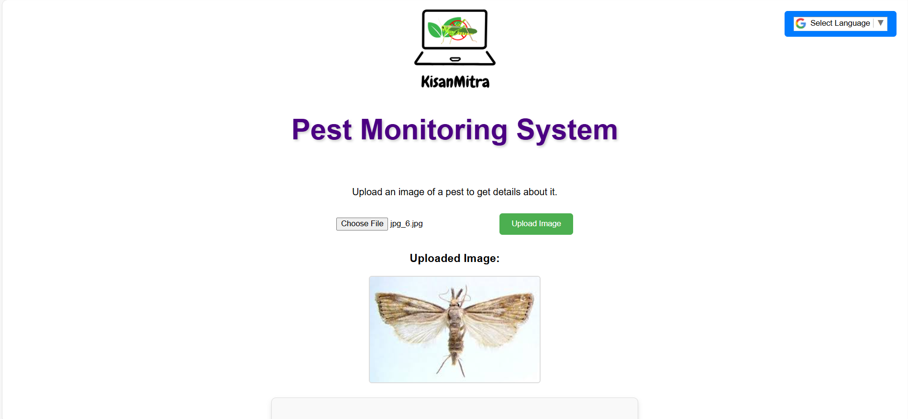
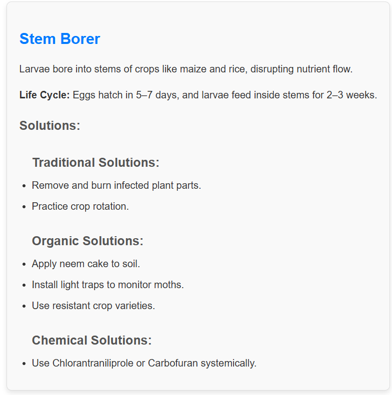
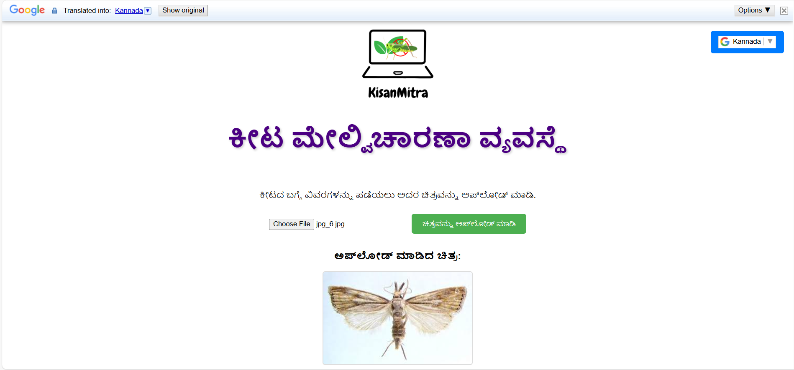
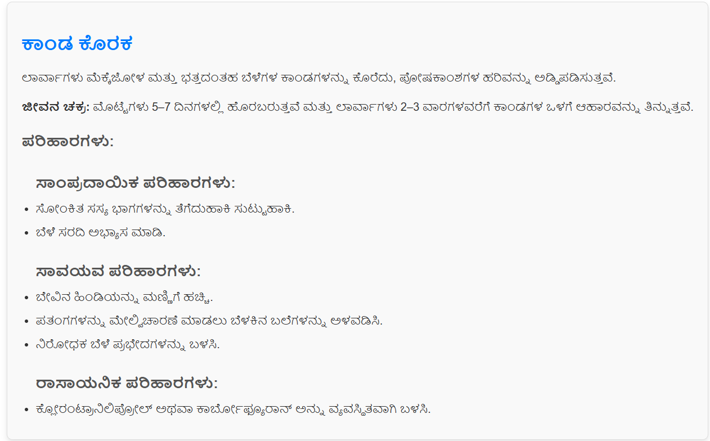

# Pest Monitoring System

## Overview
The **Pest Monitoring System** is an AI-powered tool designed to assist farmers and agricultural experts in identifying pests and providing actionable solutions for pest control. By leveraging machine learning techniques, the system predicts pest types based on images and offers detailed pest information, including their lifecycle and recommended control measures.

---

## Features
- **Image-Based Pest Identification**: Upload an image of a pest to get real-time predictions.
- **Comprehensive Pest Information**:
  - Name and description of the pest.
  - Lifecycle details.
  - Control measures (traditional, organic, and chemical solutions).
- **Real-Time Processing**: Fast and accurate predictions with a user-friendly interface.
- **Multilingual Support**: Integrated with Google Translate for accessibility in multiple languages.

---

## Tech Stack
### **Frontend**
- **React.js**: For building the user interface.
- **Axios**: For API communication.
- **Google Translate API**: For multilingual support.

### **Backend**
- **Flask**: Lightweight web framework for handling API requests.
- **Flask-CORS**: To enable Cross-Origin Resource Sharing.
- **TensorFlow**: For loading and running the trained machine learning model.
- **Pillow (PIL)**: For image preprocessing.
- **NumPy**: For numerical computations.

### **Model Training**
- **TensorFlow/Keras**: Pre-trained EfficientNetB0 model for pest classification.
- **Matplotlib**: For visualizing model performance (e.g., confusion matrix).
- **scikit-learn**: For generating classification reports.
- **Pillow (PIL)**: For image handling during preprocessing.

---

## Project Workflow
1. **Data Collection**:
   - Used a standard dataset of pest images.
2. **Model Training**:
   - Trained the EfficientNetB0 model with data augmentation to improve robustness.
3. **Backend Development**:
   - Integrated the trained model into a Flask API for real-time predictions.
4. **Frontend Development**:
   - Created a React-based web interface for users to upload images and view results.

---
## Results

